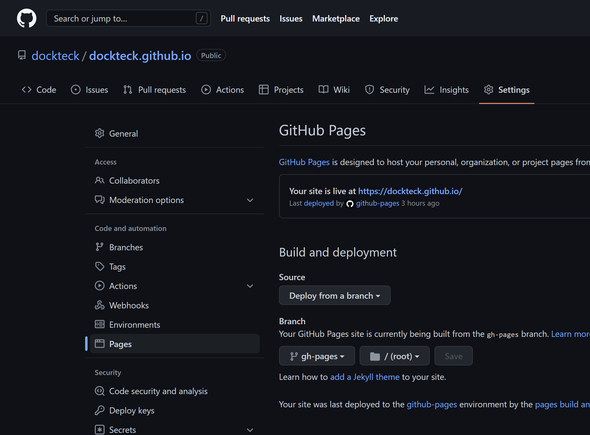

# Github Pages

いよいよGitHub Pagesで公開しよう。

予めリポジトリは作成しておいてください。  
※README.mdは作成しないほうがいいです。  
参考 - https://docs.github.com/ja/pages/getting-started-with-github-pages/creating-a-github-pages-site


## .gitignoreで無駄なファイルを除外
push時にnode_modulesと_bookは無駄なので除外します。VSCodeのターミナルから下記を実行してください。

```
type nul > .gitignore
```
```
echo node_modules/ _book >> .gitignore
```

Git操作についてはここでは説明しません。ただcommitにはコメントが必要です。日本語も可能なので適宜ご自由に変更してください。  
URLに関してはぼくの場合は、`https://github.com/dockteck/dockteck.github.io.git`となります。これはご自分のに変更してください。

## masterブランチにpush

```
git init
```
```
git add --all
```
```
git commit -m "first commit"
```
```
git remote add origin https://github.com/(user name)/(repository name).git
```
```
git branch -M master
```
```
git push -u origin master
```

## デプロイ

npmでgh-pageをインストールすることで楽ちんになります。package.jsonのscriptsに`"deploy": "npx honkit build . docs && gh-pages -d docs"`と追記すればおｋです。  
※[ぼくのサンプル](scode.md#packagejson)をコピペしてるなら、すでにインストールも設定もできています

先に、[サンプルのpackage.json](scode.md#packagejson)の5行目のhomepageのURLを自分のに置き換えてください。ぼくの場合は`https://dockteck.github.io/`になります。

次に、下記のURLを自分のに変更してください。ぼくの場合は、`https://github.com/dockteck/dockteck.github.io.git`となります。
```
git remote add origin https://github.com/(user name)/(repository name).git
```
いざ実行。
```
npm run deploy
```

### 最後に Github で設定

あとは、リポジトリのSettingsからPagesに行ってBranch欄のプルダウンをmasterからgh-pagesに変更したらSaveを押してください。


最後に上段タブにあるActionsを押してランプがオレンジから緑になったら完成です！